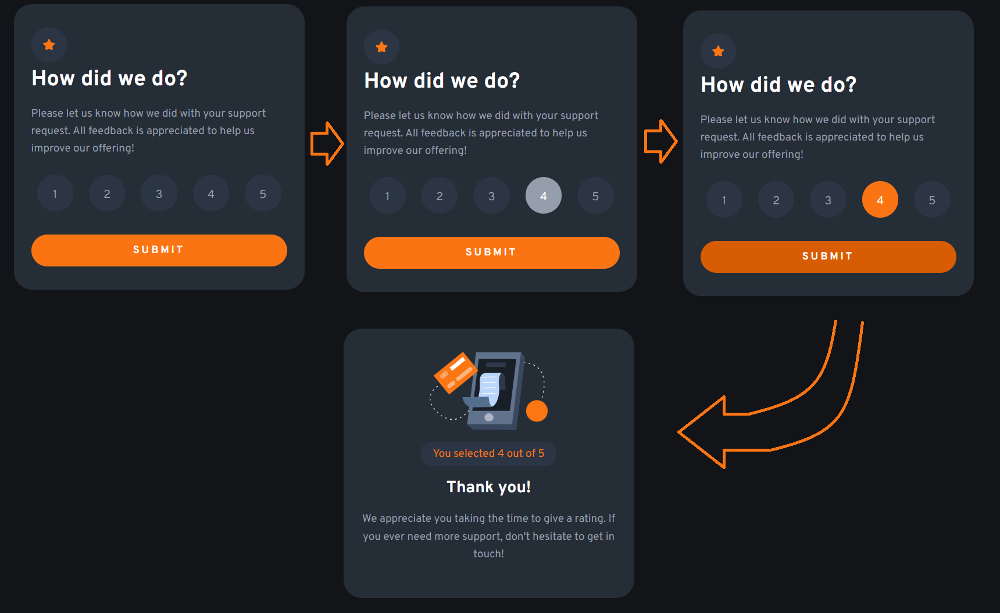

# Frontend Mentor - Interactive rating component

## Welcome! 👋

Thanks for checking out this front-end coding challenge.

[Frontend Mentor](https://www.frontendmentor.io) challenges help you improve your coding skills by building realistic projects.

**To do this challenge, I needed a basic understanding of HTML, CSS and JavaScript.**

## The challenge

My challenge was to build out this interactive rating component and get it looking as close to the design as possible.

I can use any tools I like to help me complete the challenge. So if I've got something I'd like to practice, feel free to give it a go.

## LIVE SITE: ➡️https://pettik-interactive-rating-component.netlify.app/ ⬅️ 

# Preview 🖥️⬇️

